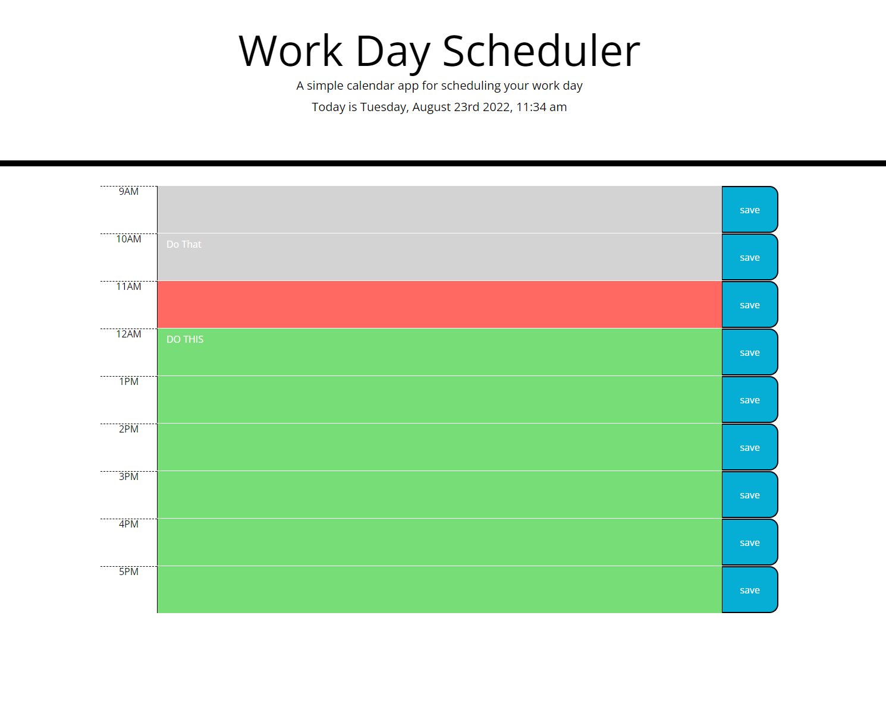

# Work Day Planner! BootCamp Module 5 Challenge

## Implemented JQuery to add functionality to this workday planner
-Added ability to input tasks for the day. Added logic to color code tasks based on past, current tasks, and due in the future.

## Used Local Storage for task persistence
-With Local Storage the tasks remain on the screen even if the website gets refreshed

## Technologies Used
-JQuery
-JavaScript
-BootStrap
-localStorage

## Link to Live Application!

## Sceenshot Below!

